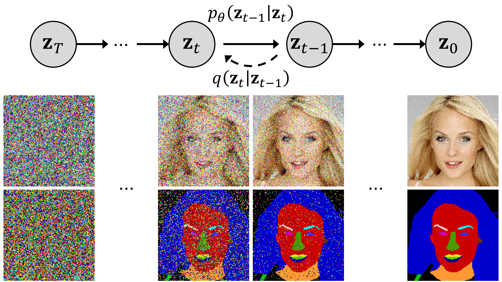

# Gaussian-Categorical Diffusion Process: Official PyTorch Implementation (ICCV 2023)

This is the official PyTorch implementation of the paper: __Learning to Generate Semantic Layouts for Higher Text-Image Correspondence in Text-to-Image Synthesis.__

> **GCDP** stands for **G**aussian-**C**ategorical **D**iffusion **P**rocess

<p align="center">
  
</p>

> **Learning to Generate Semantic Layouts for Higher Text-Image Correspondence in Text-to-Image Synthesis**  
> [Minho Park\*](https://pmh9960.github.io/), [Jooyeol Yun\*](https://yeolj00.github.io/), [Seunghwan Choi](https://github.com/shadow2496), and [Jaegul Choo](https://sites.google.com/site/jaegulchoo/)  
> KAIST  
> In ICCV 2023. (\* indicate equal contribution)

> Paper: (will be updated)  
> Project page: https://pmh9960.github.io/research/GCDP/

> **Abstract:** _Existing text-to-image generation approaches have set high standards for photorealism and text-image correspondence, largely benefiting from web-scale text-image datasets, which can include up to 5 billion pairs. However, text-to-image generation models trained on domain-specific datasets, such as urban scenes, medical images, and faces, still suffer from low text-image correspondence due to the lack of text-image pairs. Additionally, collecting billions of text-image pairs for a specific domain can be time-consuming and costly. Thus, ensuring high text-image correspondence without relying on web-scale text-image datasets remains a challenging task. In this paper, we present a novel approach for enhancing text-image correspondence by leveraging available semantic layouts. Specifically, we propose a Gaussian-categorical diffusion process that simultaneously generates both images and corresponding layout pairs. Our experiments reveal that we can guide text-to-image generation models to be aware of the semantics of different image regions, by training the model to generate semantic labels for each pixel. We demonstrate that our approach achieves higher text-image correspondence compared to existing text-to-image generation approaches in the Multi-Modal CelebA-HQ and the Cityscapes dataset, where text-image pairs are scarce._

## Updates

- [30/07/2023] Code and [project page](https://pmh9960.github.io/research/GCDP/) is open to the public.

# Gaussian-categorical Diffusion Process

Implementation of the GCDP is available in `imagen_pytorch/joint_imagen.py`.

# Installation

```
conda env create -f environment.yaml
conda activate GCDP
```

# Training GCDP

First prepare an official [Cityscapes](https://www.cityscapes-dataset.com/) / [MM CelebA-HQ](https://github.com/IIGROUP/MM-CelebA-HQ-Dataset) dataset with the following structure.

<details>
<summary>Cityscapes</summary>

```
root
 └ leftImg8bit
   └ train
    └ aachen
    └ ...
   └ val
   └ test
 └ gtFine
   └ train
    └ aachen
    └ ...
   └ val
   └ test
```

</details>

<details>
<summary>MM CelebA-HQ</summary>

```
root
 └ CelebA-HQ-img
   └ 1.jpg
   └ 2.jpg
   └ ...
 └ CelebAMask-HQ-mask-anno
   └ preprocessed
    └ 1.png
    └ 2.png
    └ ...
```

</details>

Please fill in the train/evaluation directories in the [`scripts/celeba/train_base_128x128.sh`](scripts/celeba/train_base_128x128.sh) file and execute

```
bash scripts/celeba/train_base_128x128.sh --root /path/to/data
```

# Testing GCDP

You can generate text-conditioned image-layout pairs leveraging pre-trained GCDP models.
Please fill in the path to the model checkpoints and validation directories in the [`scripts/celeba/test_base.sh`](scripts/celeba/test_base.sh) file.

```
bash scripts/celeba/test_base.sh --checkpoint_path /path/to/checkpoint
```

## Pretrained Models

Checkpoints for GCDP models are available in the links below.

|        GCDP        |    Base (128)     |     SR (256)      |
| :----------------: | :---------------: | :---------------: |
| MMCelebA-HQ (25%)  | (will be updated) | (will be updated) |
| MMCelebA-HQ (50%)  | (will be updated) | (will be updated) |
| MMCelebA-HQ (100%) | (will be updated) | (will be updated) |
|     Cityscapes     | (will be updated) | (will be updated) |

# Citation

```
@InProceedings{
    will be updated
}
```

# Acknowledgements

This repository is based on [imagen-pytorch](https://github.com/lucidrains/imagen-pytorch) by lucidrains and [Multinomial Diffusion](https://github.com/ehoogeboom/multinomial_diffusion) by Hoogeboom et al.
